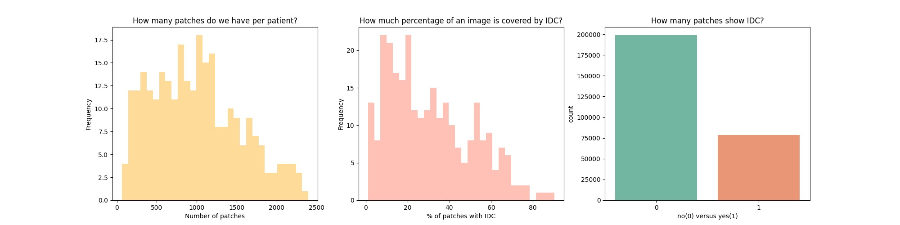
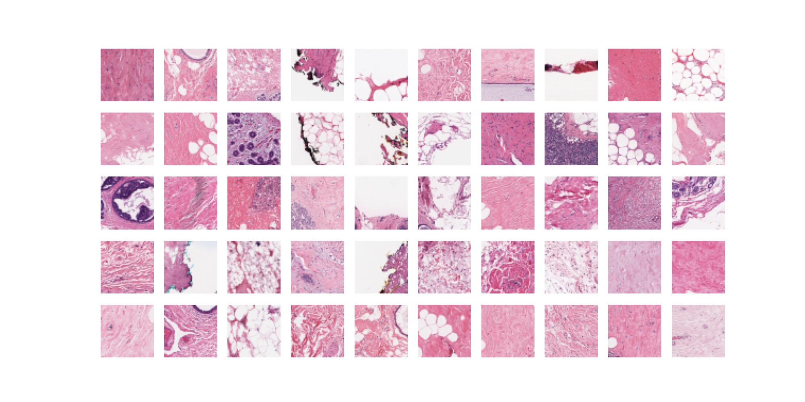
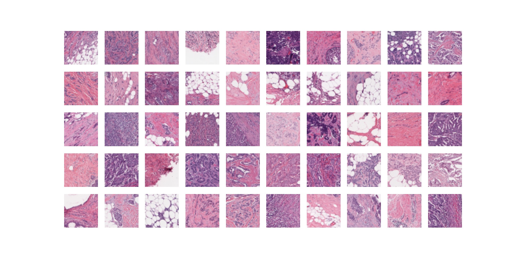
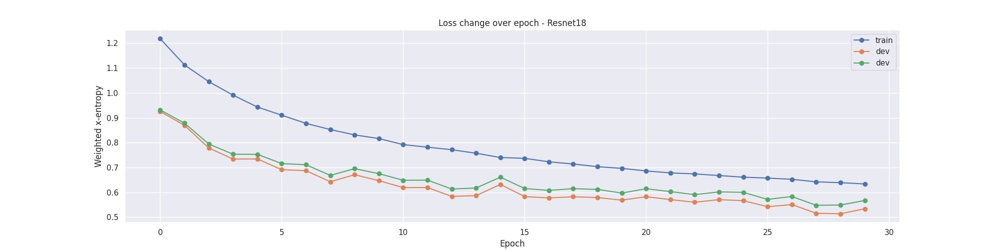
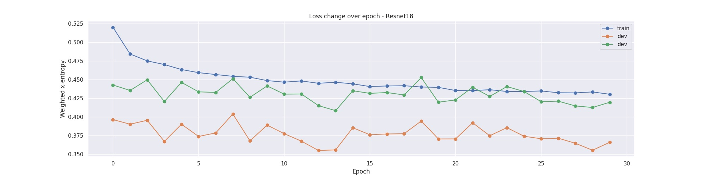

# Predicting-Medical-Tissue-Slices

Invasive ductal carcinoma (IDC) is one of the most common types of breast cancer. It's malicious and able to form metastases which makes it especially dangerous. In the project, we used two pre-trained convolutional neural networks, Resnet18 and VGG16, to detect IDC in the tissue slice images.  
This is a final project for DATS6203 Machine Learning II.

## EDA 
**Data Distribution**

 

**Negative Tissue Slices**

 

**Positive Tissue Slices**

 

## Data Preparation 
In order to avoid the overfitting issue and improve the model performance, we implemented data augmentation methods. 
1. Transformer were used to increase the diversity of the images. [Figure.11 to  Figure.14 in report](https://github.com/yueli0329/Predicting-Medical-Tissue-Slices/blob/main/Report/Final-Group-Project_Report.pdf)

2. Train a general adversarial network (GAN) was implemented to standardize the image. [Go to this GAN repo.](https://github.com/yueli0329/Medical-Image-Generation)

## Training Process
In the training process, the cyclical learning rate (CLR) search method was used when training the Resnet18 and the VGG16 framework.  The best performance is the accuracy 0.85 on the test set on Resnet18 with CLR search. 

**Four Experiments**
| Model  | CLR |
| ------------- | ------------- |
| ResNet18 | True  |
| ResNet18  | False  |
| VGG16 | True  |
| VGG16  | False  |

**The parameters of training**
| Parameter  | Value |
| ------------- | ------------- |
| Epoch | 30  |
| Batch size  | 32  |
| Learning Rate | max_lr = 0.06， min_lr = 1e-6  |
| Optimizer  | SGD  |
| Criterion  | CrossEntropyLoss(Weighted)  |
| Evaluation Metrics  | F1-Score  |

## Results
In the table, the results of the training process were shown. ResNet18 had better accuracy and less training time than VGG16. CLR method decreased the training time for both ResNet18 and VGG16. In the figures, the training processing was more stable and converged faster with CLR.\
                 
| Model  | CLR | Validation Accuracy |Training Time |
| ------------- | ------------- | ------------- | ------------- |
| ResNet18 | Yes  | 0.85% | 265m51s  | 
| ResNet18 | No  | 0.77%| 270m14s  | 
| VGG16 | Yes  | 0.79% | 390m44s  | 
| VGG16 | No  | 0.73% | 393m43s  | 

**ResNet18 Without CLR** 

 
**ResNet18 With CLR** 

 

## References
[1]Convolutional neural networks: an overview and application in radiology.[Link.](https://insightsimaging.springeropen.com/articles/10.1007/s13244-018-0639-9#Sec18) 
[2]Breast Cancer Notebook. [Link.](https://www.kaggle.com/code/allunia/breast-cancer#Exploratory-analysis-) 
[3]Breast Histopathology Images.[Link.](https://www.kaggle.com/datasets/paultimothymooney/breast-histopathology-images) 
[4]ResNet and VGG: [Why is resnet faster than vgg - Cross Validated](https://stats.stackexchange.com/questions/280179/why-is-resnet-faster-than-vgg) 
[5] Cyclic Learning rate :[Super Convergence with Cyclical Learning Rates in TensorFlow | by Christopher Thomas BSc Hons. MIAP | Towards Data Science](https://towardsdatascience.com/super-convergence-with-cyclical-learning-rates-in-tensorflow-c1932b858252) 
[6] Ibraham, Kandel., Mauro, Castelli., (2020).The effect of batch size on the generalizability of the convolutional neural networks on a histopathology dataset. Volume 6, Issue 4, Science Direct.  
[7] Cruz-Roa, A., Basavanhally, A., González, F., Gilmore, H., Feldman, M., Ganesan, S., Shih, N., Tomaszewski, J., & Madabhushi, A. (2014). Automatic detection of invasive ductal carcinoma in whole slide images with convolutional neural networks. SPIE Proceedings. https://doi.org/10.1117/12.2043872  
[8] Pix2Pix Kaggle: [Stain Transfer w/ Pix2Pix; PyTorch/Lightning | Kaggle](https://www.kaggle.com/code/shir0mani/stain-transfer-w-pix2pix-pytorch-lightning) 
[9] Salehi, P., & Chalechale, A. (2020). Pix2Pix-based stain-to-stain translation: A solution for robust stain normalization in histopathology images analysis. 2020 International Conference on Machine Vision and Image Processing (MVIP). https://doi.org/10.1109/mvip49855.2020.9116895
